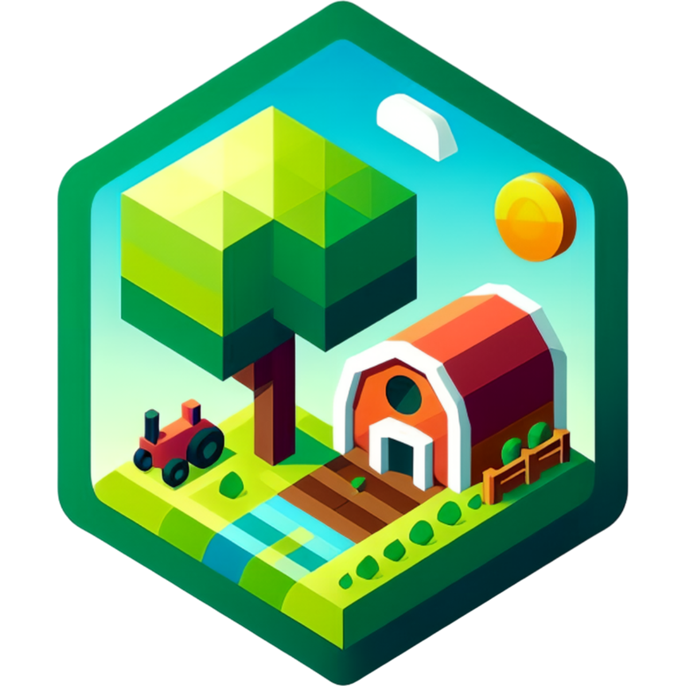
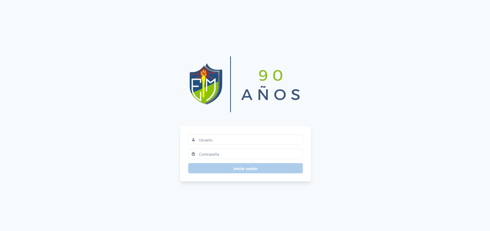
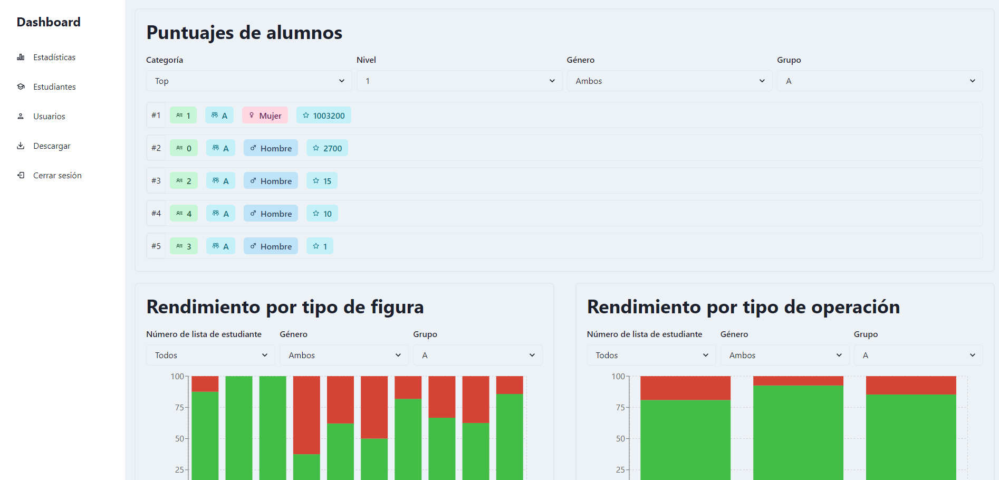
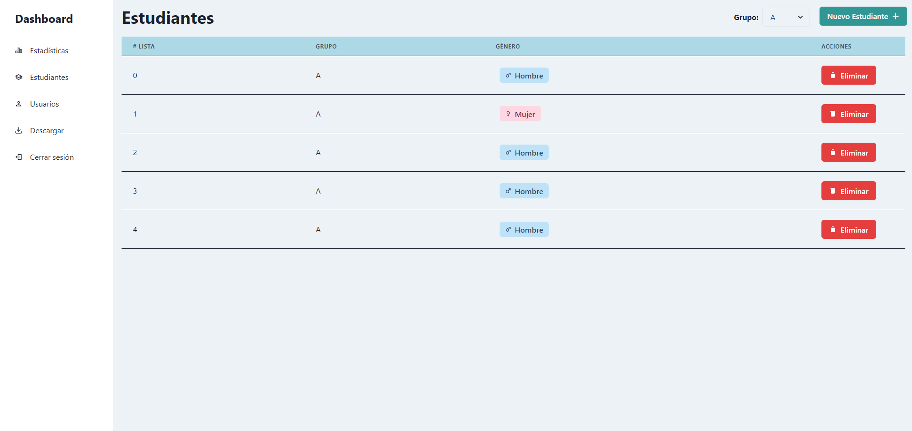
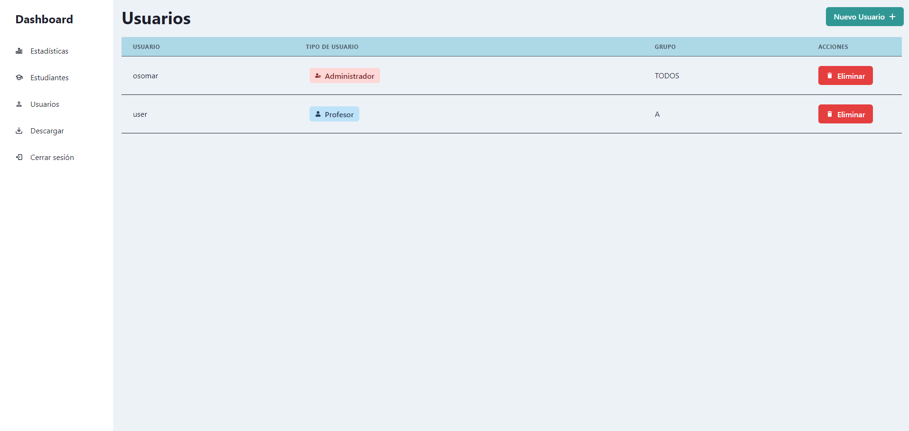
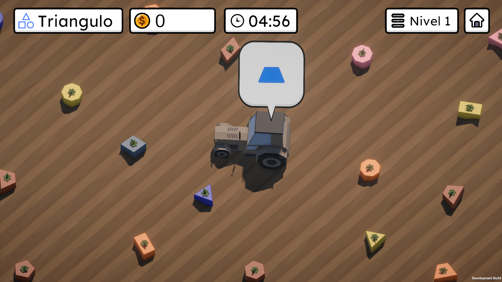
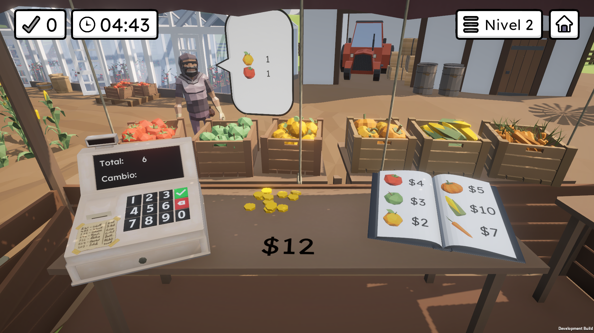
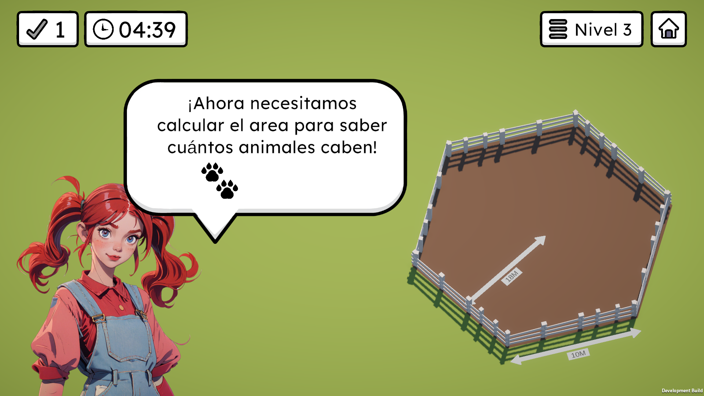

<div align="center">




<p>Educational math video game. Tailored to curriculum standards, it covers key math topics with interactive gameplay. Features a backend analytics system with mySQL database and web-based teacher dashboard for progress tracking and visualization.
</p>

</div>


<h2>About</h2>
This project is an educational math video game developed in collaboration with Escuela Metropolitana, a top-ranked elementary school in Mexico City. The game is tailored to their curriculum standards and aims to engage students in learning various mathematical concepts through interactive gameplay mechanics.
The video game covers key math topics such as shape definitions, arithmetic operations, area calculations, and more. The content is designed to align with different grade levels, ensuring that students are presented with appropriate challenges based on their current level of understanding.
In addition to the game itself, the project includes a backend analytics system that tracks individual and cohort progress, storing data in a mySQL database. The collected data is then visualized through a web-based teacher dashboard, providing insightful representations such as leaderboards, success/failure rates, progress percentages, and maximum scores achieved by level.


## Features

- Teacher/Admin Dahsboard
   - View top 5 and bottom 5 scores globally and by gender
   - View successes and failures by level
   - View maximum score per level
   - Easy-to-use interface for quick navigation and understanding of statistics
   - Authentication service for administrators to control student accounts

  
  
  
  


- Videogame
   - Level 1: Geometric shapes 
   - Level 2: Basic arithmetic (addition, subtraction, multiplication)
   - Level 3: Areas and perimeters

  
  
  


<h2>Application Architecture and Logic</h2>


The application consists of three main components:
- Unity-based videogame
- Web-based dashboard for teachers
- Backend API and database

<h2>Installation</h2>

### Prerequisites

Make sure you have the following prerequisites installed on your system:

- [Docker](https://www.docker.com/)
- [Git](https://git-scm.com/)

### Steps

1. **Clone the Repository**

   ```bash
   git clone https://github.com/Jose-AE/geometric-farm.git
   ```

2. **Navigate to the Project Directory**

   ```bash
   cd geometric-farm
   ```

3. **Run Containers**

   Use Docker Compose to spin up all the necessary containers:

   ```bash
   docker compose up
   ```

4. **Access Frontend**

   Once the containers are up and running, you can access the frontend of the application at:

   [http://localhost:3000](http://localhost:3000)

5. **Access Backend**

   The backend services will be available at:

   [http://localhost:5173](http://localhost:5173)

6. **Access MySQL Server**

   The MySQL server instance can be accessed at:

   `localhost:3306`

7. **Installing Game**

   Download the installer from the [latest release](https://github.com/Jose-AE/geometric-farm/releases/tag/v1.0.0)

8. **(Optional) Setup custom videogame API URL**

   Once the game launches and you are at the login page, you can press **CTRL** + **BACKSPACE** to open the configuration menu. Here, you can change the API URL to a custom one if you are hosting the backend somewhere other than `http://localhost:3000`


   
## Built With

<a href="https://www.typescriptlang.org/" target="_blank" rel="noreferrer">  </a>
<a href="https://expressjs.com" target="_blank" rel="noreferrer">  </a>
<a href="https://reactjs.org/" target="_blank" rel="noreferrer">  </a>
<a href="https://chakra-ui.com/" target="_blank" rel="noreferrer">  </a>
<a href="https://unity.com/" target="_blank" rel="noreferrer">  </a>
<a href="https://www.w3schools.com/cs/" target="_blank" rel="noreferrer">  </a>


## License
<p>Geometric Farm is released under the <a href="LICENSE">GNU General Public License v3.0</a>.</p>